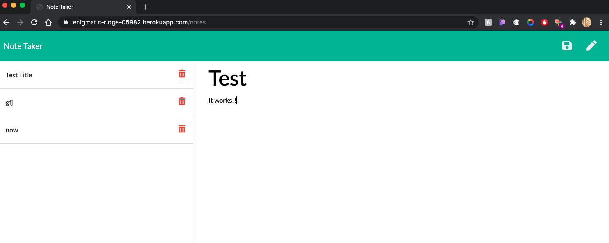

# Note Taker
An application that can be used to write and save notes. 

## Pseudo Code

1. Install express and uniqid 
2. Create a server js file
3. Within this file, use express to handle the server requests

Based on this my code would have to:
- Be able to run on the local server
- Use express to get and fetch data requests

## Difficulties

I found some issues with the starter code we were given which resulted in me losing a lot of time as I had to fix those errors to make my code work. I also had some difficulties with getting the save button to show which was fairly annoying as it seemed to be an issue with the starter code rather than my code. Overall, I found most of the difficulties for this task arising from the starter code. 

## Overall thoughts

This task was quite fun, and I liked learning how to properly use express. In the future I hope to develop this app further and allow for notes to be deleted, but unfortunately I ran out of time. 

## Deployed application

You can run the application [here]( https://enigmatic-ridge-05982.herokuapp.com/)

